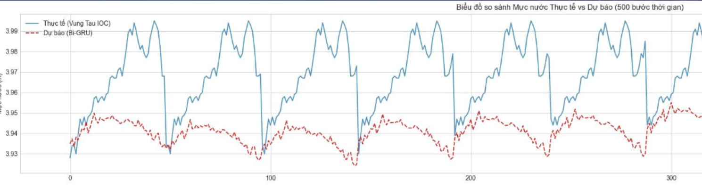
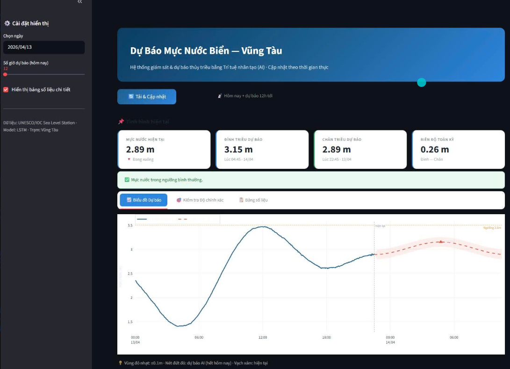
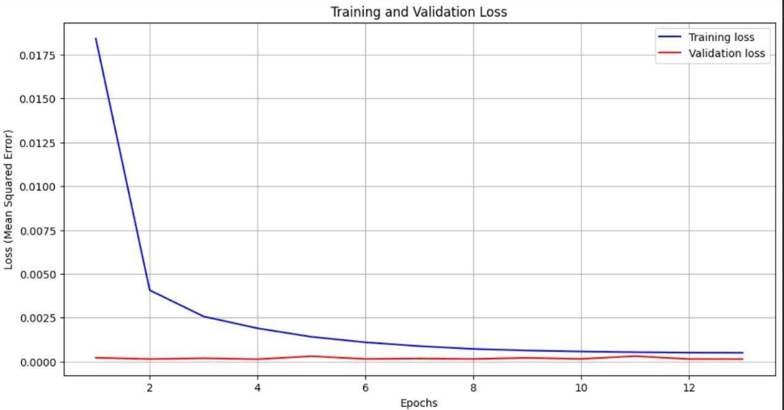

# Real-Time-Tide-Forecasting-System-using-GRU

 Hệ thống dự báo mực nước thủy triều thời gian thực tại trạm Vũng Tàu sử dụng mô hình học sâu GRU.


## Giới thiệu

Dự án xây dựng hệ thống thu thập, xử lý dữ liệu chuỗi thời gian và dự báo mực nước biển bằng mô hình GRU (Gated Recurrent Unit). GRU phù hợp với dữ liệu thủy triều vì có khả năng ghi nhớ phụ thuộc dài hạn và học tốt các chu kỳ lặp lại theo thời gian.

## Chức năng chính

- Thu thập dữ liệu thủy triều trạm Vũng Tàu
- Tiền xử lý dữ liệu chuỗi thời gian
- Phát hiện outlier và nội suy dữ liệu thiếu
- Mã hóa đặc trưng thời gian bằng sin/cos
- Huấn luyện mô hình GRU
- Dự báo mực nước thủy triều trong 12 giờ tiếp theo
- Hiển thị kết quả bằng giao diện Streamlit

## Công nghệ sử dụng

- Python
- TensorFlow / Keras
- Pandas
- NumPy
- Scikit-learn
- Streamlit
- Matplotlib / Plotly

## Cấu trúc thư mục

```text
Real-Time-Tide-Forecasting-System-using-GRU/
│
├── Data/                  # Thư mục dữ liệu
├── caodulieu.py           # Thu thập/cào dữ liệu
├── TXL.py                 # Tiền xử lý dữ liệu
├── Train.py               # Huấn luyện mô hình GRU
├── DanhGia.py             # Đánh giá mô hình
├── index.py               # Giao diện Streamlit
├── vungtau_full_from_2024_06_01.csv
├── .gitignore
└── README.md
```
## Mô hình GRU

Mô hình sử dụng kiến trúc GRU xếp chồng với các lớp 128 và 64 units. Dữ liệu đầu vào sử dụng 120 bước thời gian quá khứ, tương đương 30 giờ, để dự báo 48 bước tương lai, tương đương 12 giờ.

## Dataset

Một số file dữ liệu lớn như .npy không được lưu trực tiếp trên GitHub do giới hạn dung lượng file.
Để chạy đầy đủ dự án, cần đặt dữ liệu vào thư mục:
```text
Data/
```
Ví dụ:
```text
Data/X_train.npy
Data/y_train.npy
```

## Cài đặt
```bash
pip install tensorflow pandas numpy scikit-learn streamlit matplotlib plotly
```


## Prediction Result


## Web Interface


## Training Performance


## Chạy chương trình

### 1. Chạy giao diện dự báo:
```bash
streamlit run index.py
```
### 2. Huấn luyện mô hình:
```bash
python Train.py
```
### 3. Đánh giá mô hình:
```bash
python DanhGia.py
```
